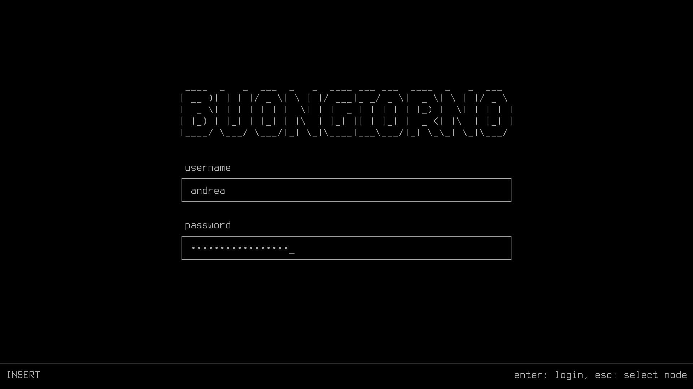

# [buongiorno]

[](https://builds.sr.ht/~andreafeletto/buongiorno/commits/main)

A modal TUI greeter for [greetd] written in [zig] using [spoon].



## Installation

This repository contains git submodules. To get it, run:

```
git clone https://git.sr.ht/~andreafeletto/buongiorno
cd buongiorno
git submodule update --init
```

If your system uses `systemd-tmpfiles`:

```
zig build --release=safe -Dsystemd
sudo zig build --release=safe -Dsystemd --prefix /usr
```

Otherwise, you will have to manually install the cache directory:

```
zig build --release=safe
sudo zig build --release=safe --prefix /usr
sudo install -d /var/cache/buongiorno -o greeter -g greeter
```

## Configuration

The following `/etc/greetd/config.toml` sets "andrea" as the dafault user and
tells buongiorno to launch the command `compositor` after a successful login.

```
[default_session]
command = "buongiorno -c compositor -u andrea"
```

## Contributing

Please join the [#andreafeletto] IRC channel to ask for help or to give
feedback.
You are welcome to send patches to the [mailing list] or report bugs on the
[issue tracker].
If you aren't familiar with `git send-email`, you can use the [web interface]
or learn about it by following this excellent [tutorial].

[buongiorno]: https://sr.ht/~andreafeletto/buongiorno
[greetd]: https://sr.ht/~kennylevinsen/greetd
[zig]: https://ziglang.org
[spoon]: https://sr.ht/~leon_plickat/zig-spoon
[#andreafeletto]: ircs://irc.libera.chat/#andreafeletto
[mailing list]: https://lists.sr.ht/~andreafeletto/public-inbox
[issue tracker]: https://todo.sr.ht/~andreafeletto/buongiorno
[web interface]: https://git.sr.ht/~andreafeletto/buongiorno/send-email
[tutorial]: https://git-send-email.io
