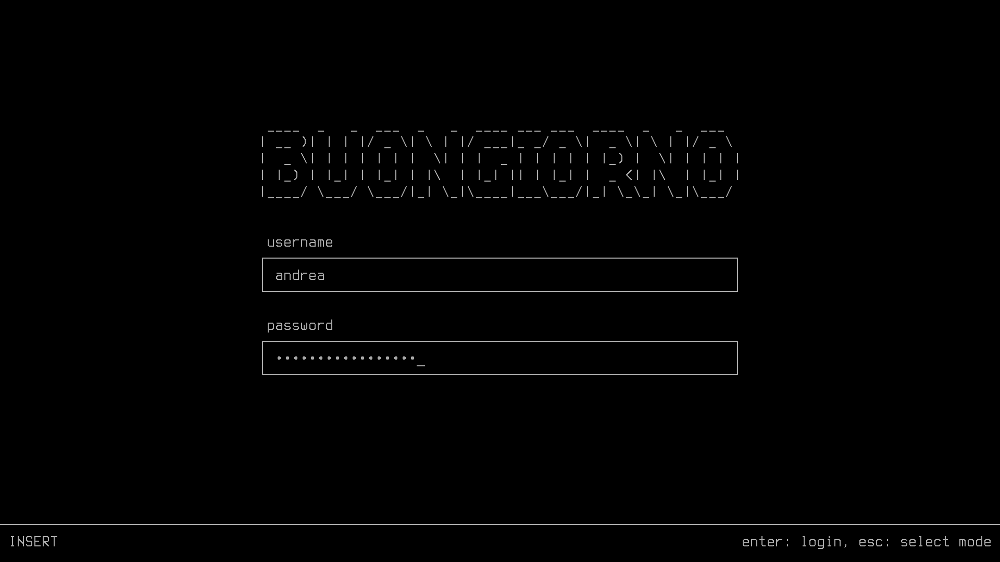

# [buongiorno]

A modal TUI greeter for [greetd] written in [zig] using [spoon].



## Installation

If your system uses `systemd-tmpfiles`:

```
zig build --release=safe -Dsystemd
sudo zig build --release=safe -Dsystemd --prefix /usr
```

Otherwise, you will have to manually install the cache directory:

```
zig build --release=safe
sudo zig build --release=safe --prefix /usr
sudo install -d /var/cache/buongiorno -o greeter -g greeter
```

## Configuration

The following `/etc/greetd/config.toml` sets "andrea" as the dafault user and
tells buongiorno to launch the command `compositor` after a successful login.

```
[default_session]
command = "buongiorno -c compositor -u andrea"
```

## Contributing

[buongiorno]: https://sr.ht/~andreafeletto/buongiorno
[greetd]: https://sr.ht/~kennylevinsen/greetd
[zig]: https://ziglang.org
[spoon]: https://sr.ht/~leon_plickat/zig-spoon
